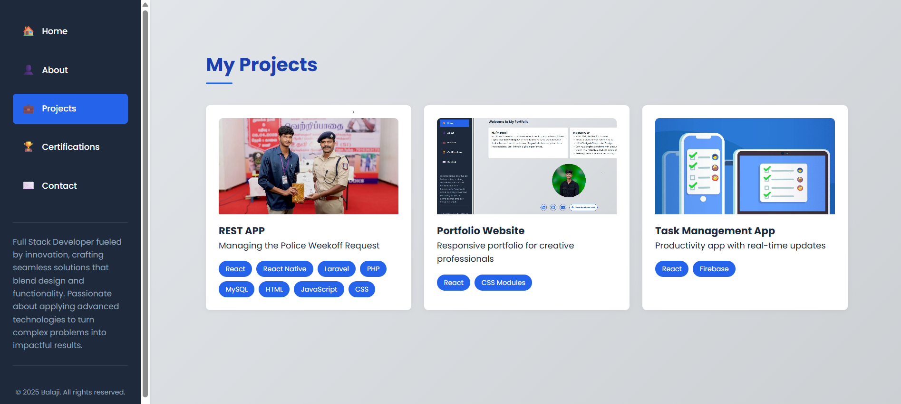
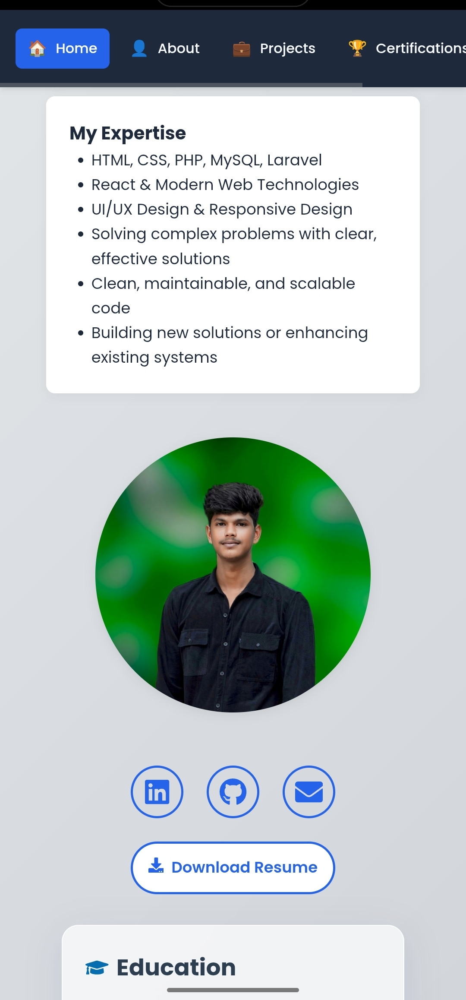

   
# 🌐 Personal Portfolio Website

🚀 A modern and responsive **Portfolio Website** built with **React.js** to showcase my projects, skills, and achievements.  

👉 **Live Demo:** [Click Here](https://portbalaji.netlify.app/)  

---

## 📸 Screenshot
### Home Page
<p align="center">
  
</p>

---
### Project page
<p align="center">
  
</p>

---

###  Mobile View
<p align="center">
  
</p>

---

## ✨ Features

- 🖥️ Responsive design (mobile + desktop friendly)  
- 👨‍💻 Showcases my **projects, resume, and contact info**  
- 🎨 Clean UI/UX with smooth navigation  
- ⚡ Built using **React.js + CSS3**  
- 📂 Easy to update and customize  

---

## 🛠️ Tech Stack

- **React.js** – Frontend  
- **CSS3** – Styling  
- **HTML5** – Structure  
- **JavaScript (ES6+)** – Logic  

---

## 🔧 Installation & Usage

Clone the repo:
```bash
git clone https://github.com/Bala9840/Port.git
````

Navigate to the project:

```bash
cd Port
```

Install dependencies:

```bash
npm install
```

Run locally:

```bash
npm start
```

Build for production:

```bash
npm run build
```

---

## 📌 Future Enhancements

* 🌙 Dark mode support
* ✨ Animations for project cards
* 📧 Contact form with backend integration

---

## 👨‍💻 Author

**Balaji (Bala9840)**
📌 [GitHub](https://github.com/Bala9840) | [LinkedIn](https://www.linkedin.com/in/balaji9840)

---

📜 This project is licensed under the **MIT License** – feel free to use and customize.

---
